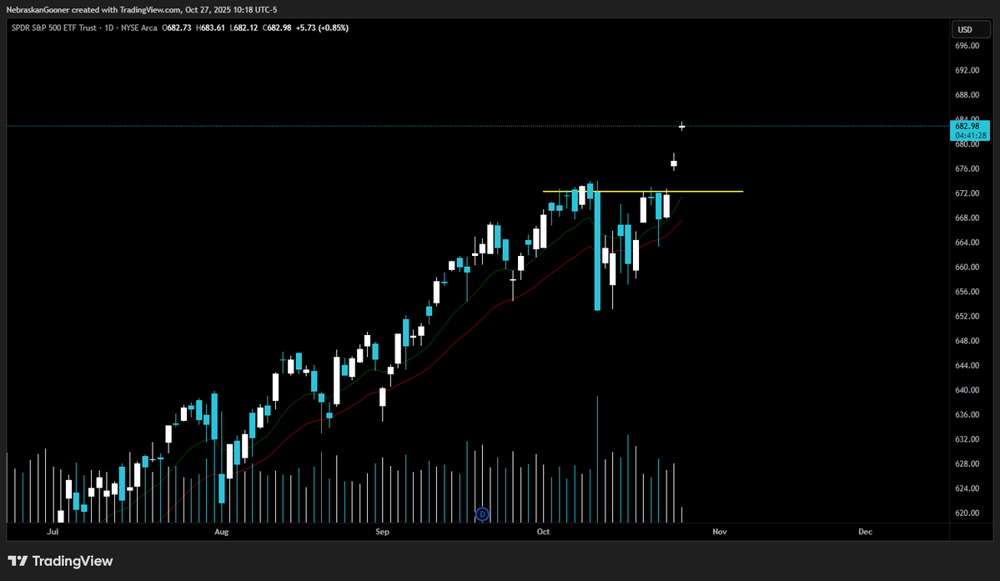

# Chart Extractor 📈⛏️

<!-- Add a banner here like: https://github.com/StephanAkkerman/fintwit-bot/blob/main/img/logo/fintwit-banner.png -->

---
<!-- Adjust the link of the first and second badges to your own repo -->
<p align="center">
  
  
  <a href="https://github.com/psf/black"></a>
</p>

## Introduction

Chart-extractor provides tools for extracting important information from financial charts, utilizing the [chart-info-detector](https://github.com/StephanAkkerman/chart-info-detector) model and OCR tools. It detects the chart title and the small price "pill" in screenshots, runs OCR on those regions, and applies lightweight parsing heuristics to convert raw OCR text into structured fields such as symbol, exchange, timeframe, price, and trading session. The project is designed primarily for TradingView-style screenshots but also works with similar chart widgets. It uses RapidOCR (ONNX runtime) for fast local inference. Use the library programmatically, the small CLI for quick JSON output, or the example script for experiments.

## Example
Given an Tradingview chart image like the one below, it will extract the information such as price, symbol, exchange, and timeframe.

<details closed>
<summary>Input Image Example 📊</summary>

</details>

Output:
```
ExtractResult(symbol='SPOR S&P 500 ETF Trust', exchange='NYSE', timeframe='1D', price=682.98, session='regular', raw_title_text='SPOR S&P 500 ETF Trust · 1D · NYSE Arca', raw_pill_text='682.98 :28', det_title_box=(13, 28, 193, 38), det_pill_box=(1139, 145, 1186, 168))
```

## Table of Contents 🗂

- [Installation](#installation)
- [Usage](#usage)
- [Citation](#citation)
- [Contributing](#contributing)
- [License](#license)

## Installation ⚙️
<!-- Adjust the link of the second command to your own repo -->

The required packages to run this code can be found in the requirements.txt file. To run this file, execute the following code block after cloning the repository:

```bash
pip install -r requirements.txt
```

or

```bash
pip install git+https://github.com/StephanAkkerman/chart-extractor.git
```

## Usage ⌨️

## Citation ✍️
<!-- Be sure to adjust everything here so it matches your name and repo -->
If you use this project in your research, please cite as follows:

```bibtex
@misc{chart_extractor_2025,
  author  = {Stephan Akkerman},
  title   = {Chart Extractor},
  year    = {2025},
  publisher = {GitHub},
  journal = {GitHub repository},
  howpublished = {\url{https://github.com/StephanAkkerman/chart-extractor}}
}
```

## Contributing 🛠
<!-- Be sure to adjust the repo name here for both the URL and GitHub link -->
Contributions are welcome! If you have a feature request, bug report, or proposal for code refactoring, please feel free to open an issue on GitHub. We appreciate your help in improving this project.\


## License 📜

This project is licensed under the MIT License. See the [LICENSE](LICENSE) file for details.
